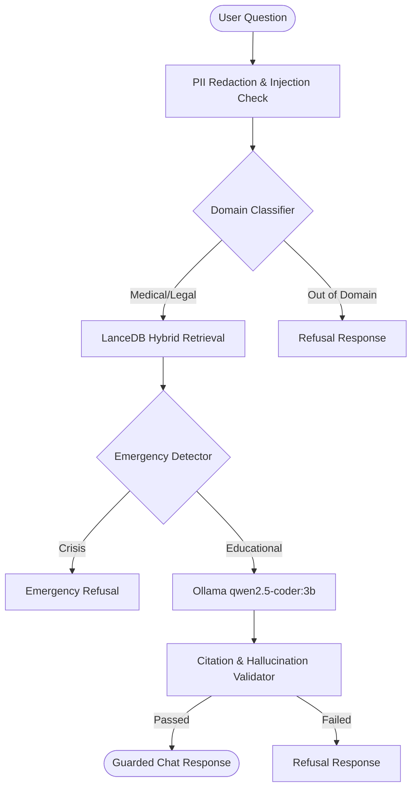

# St. Joseph's Guarded Chat (MedLaw Guard)

An intelligent, secure, dual-domain (**Medical** and **Legal**) educational chatbot with a fully working local **Retrieval-Augmented Generation (RAG)** pipeline. The system runs locally using a discrete **NVIDIA RTX 5060 GPU** to power **Ollama** model inference.

---

## 🚀 Features

- **RTX 5060 GPU Acceleration**: Seamless integration with local Ollama (`qwen2.5-coder:3b`) running model inference on GPU.
- **Local RAG Integration**: Powered by **LanceDB** vector store and `BAAI/bge-small-en-v1.5` embeddings for real-time document search.
- **Dual-Dataset Ingestion**:
  - **Law/Education Dataset**: Indian school statistics parsed and indexed.
  - **Medical Dataset**: Clinical consultation Q&A archives indexed.
- **Secure Dual-Domain Guardrails**:
  - **Domain Classifier**: Boosted with a dictionary of 600 custom keywords (300 medical, 300 legal) to prevent false classification.
  - **Medical Emergency Detector**: Automatically detects active crises but allows educational questions (e.g. "What causes a heart attack?").
  - **PII Anonymization**: Smart redaction of critical private info while leaving location terms intact for RAG search.
  - **Citation & Hallucination Checker**: Verifies factual grounding of LLM responses against retrieved database documents.

---

## 🛠️ Architecture



---

## ⚙️ Project Setup & Installation

### Prerequisites
- [Miniconda](https://docs.conda.io/en/latest/miniconda.html) or Anaconda.
- [Node.js & npm](https://nodejs.org/).
- [Ollama](https://ollama.com/) installed and running.

---

### Backend Setup (FastAPI)
1. Navigate to the `backend/` directory:
   ```bash
   cd backend
   ```
2. Initialize or connect to your Conda environment:
   ```bash
   conda activate dgpu-core
   ```
3. Install dependencies:
   ```bash
   pip install -r requirements.txt
   ```
4. Run the data ingestion scripts to index the datasets:
   ```bash
   # Ingest Law stats
   python -m ingest_law_dataset
   # Ingest Medical consultations
   python -m ingest_medical_dataset
   ```
5. Start the FastAPI backend server:
   ```bash
   python -m uvicorn app.main:app --host 127.0.0.1 --port 8000
   ```

---

### Frontend Setup (Express & React/Vite)
1. Navigate to the `ai-chatbot/` directory:
   ```bash
   cd ../ai-chatbot
   ```
2. Install npm dependencies:
   ```bash
   npm install
   ```
3. Start the Express server and Vite development bundler:
   ```bash
   npm run dev
   ```
4. Access the web interface at [http://localhost:3000](http://localhost:3000).

---

## 🖥️ Live Telemetry & Health

- **Backend Health Endpoint**: `http://localhost:8000/api/health`
- **Frontend Health Endpoint**: `http://localhost:3000/api/health`
- **Active Ollama Port**: `http://localhost:11434`
