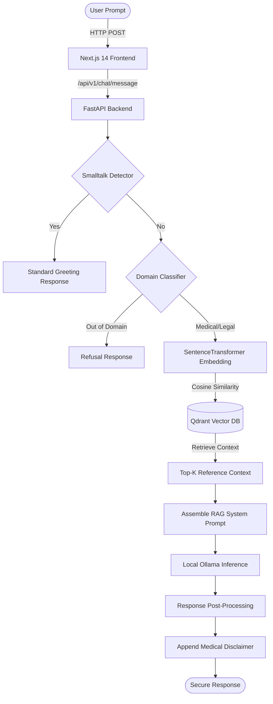

# St. Joseph's Guarded Chat (MedAI Enterprise)

An enterprise-grade, secure, educational AI assistant specializing in clinical questions and Healthcare Law. Featuring a fully local **Retrieval-Augmented Generation (RAG)** pipeline, the system utilizes local vector storage, embedding generation, and large language model (LLM) inference running with GPU acceleration (RTX 5060/CUDA) when available.

---

## 🚀 Features

- **Next.js 14 Frontend**: A modern, interactive web interface built using the Next.js App Router, TailwindCSS, and Geist typography.
- **FastAPI Backend**: A modular, robust asynchronous Python API server powered by Uvicorn.
- **Local RAG Integration**: Uses a disk-based **Qdrant** database instance for semantic search without requiring an external server.
- **Fast Local Embeddings**: Utilizes `SentenceTransformer` (`BAAI/bge-small-en-v1.5`) for generating vector representations, automatically utilizing GPU CUDA acceleration on Nvidia hardware.
- **Local LLM Execution**: Harnesses **Ollama** (`qwen2.5-coder:3b` or other configured LLMs) for local, secure inference.
- **Domain Guardrails**: Integrates rule-based smalltalk interceptors and zero-shot LLM classifiers to ensure queries remain within medical/legal bounds, safely refusing out-of-domain prompts.
- **Structured Database Schema**: Utilizes **SQLAlchemy** (asyncio) and **Alembic** migrations on PostgreSQL/SQLite to persist users, conversations, and chat history.
- **Celery Tasks**: Configured for background job execution using Redis as a message broker.

---

## 🛠️ System Architecture

The following Mermaid diagram illustrates the detailed sequence of operations, from the user's query in the frontend to the final response generation using local RAG:



---

## 📁 Directory Structure

```text
MediBot/
├── MAJACHATBOT/
│   └── medai-enterprise/
│       ├── backend/
│       │   ├── alembic/              # Database migration configuration
│       │   ├── app/
│       │   │   ├── api/              # API Endpoints (health, chat, etc.)
│       │   │   ├── core/             # Configuration & environment settings
│       │   │   ├── db/               # SQLAlchemy Session and database config
│       │   │   ├── models/           # SQLAlchemy Declarative Models (User, Conversation, Message)
│       │   │   └── services/         # Chatbot logic, RAG pipeline, and Qdrant integration
│       │   ├── .env.example          # Environment variables template
│       │   ├── requirements.txt      # Python dependencies list
│       │   ├── ingest_qdrant.py      # Dataset ingestion script into Qdrant
│       │   └── test_rag.py           # Verification script for local retrieval
│       ├── frontend/
│       │   ├── public/               # Static assets
│       │   ├── src/
│       │   │   └── app/              # Next.js App Router Pages & Layouts
│       │   ├── package.json          # Node dependencies & scripts
│       │   └── tsconfig.json         # TypeScript configuration
│       └── docker-compose.yml        # Services containerization setup
├── ai-medical-chatbot.csv            # Source medical consulting dataset (Ignored from Git)
└── README.md                         # Main Documentation
```

---

## ⚙️ Setup & Installation

### Prerequisites
1. **Ollama**: Download and install [Ollama](https://ollama.com/). Make sure it is running locally.
   ```bash
   ollama pull qwen2.5-coder:3b
   ```
2. **Node.js**: Ensure Node.js (v18+) is installed.
3. **Python**: Ensure Python (v3.10+) or Conda is installed.
4. **Redis** (Optional): Needed if running background Celery tasks.

---

### 1. Backend Setup (FastAPI)

1. Navigate to the backend directory:
   ```bash
   cd MAJACHATBOT/medai-enterprise/backend
   ```
2. Create and activate a virtual environment:
   ```bash
   python -m venv venv
   # On Windows:
   .\venv\Scripts\activate
   # On macOS/Linux:
   source venv/bin/activate
   ```
3. Install dependencies:
   ```bash
   pip install -r requirements.txt
   ```
4. Configure your environment variables. Copy `.env.example` to `.env` and update the values:
   ```bash
   cp .env.example .env
   ```
5. Ingest the dataset. Run the script to generate embeddings and load them into Qdrant:
   ```bash
   python ingest_qdrant.py --limit 5000
   ```
6. Start the FastAPI application:
   ```bash
   python -m uvicorn app.main:app --host 127.0.0.1 --port 8005 --reload
   ```

---

### 2. Frontend Setup (Next.js)

1. Navigate to the frontend directory:
   ```bash
   cd ../frontend
   ```
2. Install npm dependencies:
   ```bash
   npm install
   ```
3. Run the development server:
   ```bash
   npm run dev
   ```
4. Access the user interface at [http://localhost:3000](http://localhost:3000).

---

## 🔍 Verification

To test that the RAG pipeline is working correctly independently of the web frontend, run the validation script:
```bash
cd MAJACHATBOT/medai-enterprise/backend
python test_rag.py
```
This will query the local Qdrant collection and return the closest clinical QA matches.

---

## ⚖️ Disclaimer

*The answers provided by St. Joseph's Guarded Chat are for educational purposes only and do not replace professional medical advice, diagnosis, or legal counsel.*
